<a id="haut"></a>

<p align="center">
  
</p>

<h1 align="center">EvoFarm</h1>

<p align="center">
  <strong>Suivez vos sessions. Choisissez votre prochain farm.</strong><br>
  Bilans, bénéfices et comparaisons pour tous les joueurs de Dofus Retro.
</p>

<p align="center">
  <a href="https://github.com/Donj63000/Dofus-Retro-EvoFarm-Dev-By-Donj63000-Coca/releases/latest"></a>
  <a href="https://github.com/Donj63000/Dofus-Retro-EvoFarm-Dev-By-Donj63000-Coca/actions/workflows/ci.yml"></a>
</p>

<p align="center">
  <a href="#télécharger-et-commencer"><strong>Télécharger</strong></a> ·
  <a href="#evofarm-en-vidéo"><strong>Voir la vidéo · 4 min</strong></a> ·
  <a href="#evofarm-en-images"><strong>Voir les 12 captures</strong></a> ·
  <a href="docs/demo/README.md#importer-la-demo"><strong>Essayer la démo</strong></a> ·
  <a href="#documentation-technique">Documentation technique</a>
</p>

---

| Choisir son activité | Comprendre ses résultats | Suivre sa progression |
| :--- | :--- | :--- |
| Trouvez quoi farmer selon **votre classe et votre temps disponible**. | Comparez les gains en tenant compte des **clefs, pierres et captures**. | Retrouvez vos **bilans, classements et historiques** au fil des sessions. |

<p align="center"><strong>Windows · macOS · Linux</strong><br>Sans compte, sans abonnement. Vos données restent sur votre ordinateur.</p>

## EvoFarm en vidéo

**Découvrez EvoFarm en 4 minutes** : bilans, saisie d'une session, recherche d'activité et sauvegardes, avec un point sur le fonctionnement local et les limites de sécurité.

https://github.com/user-attachments/assets/030daba9-fac2-4277-8b7d-90173de4b67c

[Ouvrir ou télécharger la vidéo](https://github.com/user-attachments/assets/030daba9-fac2-4277-8b7d-90173de4b67c) · [Sous-titres français](docs/demo/videos/EvoFarm-demonstration-fr.srt)

*Démonstration scénarisée avec des données fictives · 1080p · Musique et sous-titres français intégrés, sans voix off. Les constats de sécurité présentés datent du 13 septembre 2026.*

## Télécharger et commencer

<table>
  <tr>
    <th width="33%">Windows</th>
    <th width="34%">macOS</th>
    <th width="33%">Linux</th>
  </tr>
  <tr>
    <td align="center"><strong>x64 · Portable</strong><br><br><a href="https://github.com/Donj63000/Dofus-Retro-EvoFarm-Dev-By-Donj63000-Coca/releases/latest/download/EvoFarm.exe"><strong>Télécharger EvoFarm.exe</strong></a><br><a href="https://github.com/Donj63000/Dofus-Retro-EvoFarm-Dev-By-Donj63000-Coca/releases/latest/download/EvoFarm-Windows-x64.zip">Version ZIP</a></td>
    <td align="center"><strong>Intel + Apple Silicon</strong><br><br><a href="https://github.com/Donj63000/Dofus-Retro-EvoFarm-Dev-By-Donj63000-Coca/releases/latest/download/EvoFarm-macOS-universal.zip"><strong>Télécharger le ZIP universel</strong></a><br>Une seule application, deux architectures</td>
    <td align="center"><strong>x64 · Bureau Linux</strong><br><br><a href="https://github.com/Donj63000/Dofus-Retro-EvoFarm-Dev-By-Donj63000-Coca/releases/latest/download/EvoFarm-Linux-x64.tar.gz"><strong>Télécharger l'archive TAR.GZ</strong></a><br>Base Ubuntu 22.04 / glibc 2.35</td>
  </tr>
</table>

**1. Lancez EvoFarm** → **2. Renseignez une session** → **3. Consultez vos bilans**

[Toutes les versions et notes de publication](https://github.com/Donj63000/Dofus-Retro-EvoFarm-Dev-By-Donj63000-Coca/releases) · [Importer le mois de démonstration](docs/demo/README.md#importer-la-demo)

<details>
<summary><strong>Installation et premier lancement sur votre système</strong></summary>

Sous Windows, lancez `EvoFarm.exe`. Sur macOS, extrayez le ZIP, placez `EvoFarm.app` dans Applications et ouvrez-la. Sous Linux, extrayez l'archive et lancez `./EvoFarm/evofarm`.

### Windows

Le programme est portable et intègre son runtime C. Un raccourci vers `EvoFarm.exe` permet de l'épingler au menu Démarrer ou à la barre des tâches, avec le logo de l'application. Les distributions GitHub ne disposent pas d'une signature Authenticode.

### macOS

Le même fichier `EvoFarm.app` contient les versions **Intel x64 et Apple Silicon ARM64**. Le minimum de déploiement est **macOS 11.0** ; les contrôles natifs de la CI sont exécutés sur macOS 15 pour les deux architectures.

Le bundle possède une signature **ad hoc**, sans certificat Developer ID ni notarisation Apple. Si macOS bloque la première ouverture, après avoir essayé de lancer l'app, accédez à **Réglages Système → Confidentialité et sécurité → Ouvrir quand même**, puis confirmez avec **Ouvrir**. Ce parcours est décrit dans l'[assistance Apple](https://support.apple.com/fr-fr/102445).

### Linux

La distribution est construite sur **Ubuntu 22.04 x64**, avec une base **glibc 2.35**. Elle vise les distributions compatibles avec cette base ou une version ultérieure, disposant d'un bureau X11 ou Wayland et d'OpenGL. Les dialogues d'import utilisent XDG Desktop Portal avec un backend GTK, GNOME ou KDE. La présence d'une glibc compatible ne suffit pas si ces bibliothèques de bureau manquent.

Sur Ubuntu 22.04, les composants d'exécution peuvent être installés ainsi :

```bash
sudo apt install libx11-6 libx11-xcb1 libxcb1 libxkbcommon0 libxkbcommon-x11-0 \
  libgl1 libegl1 libwayland-client0 xdg-desktop-portal xdg-desktop-portal-gtk
tar -xzf EvoFarm-Linux-x64.tar.gz
./EvoFarm/evofarm
```

L'archive contient également `logo.png`, `fr.donj63000.evofarm.desktop` et **`install-desktop.sh`**. L'exécution facultative de `./EvoFarm/install-desktop.sh` ajoute le raccourci et son icône au menu des applications de votre utilisateur, sans droits administrateur. **Conservez ensuite le dossier extrait au même emplacement** : le raccourci référence son exécutable. Pour déplacer le programme, relancez ce script depuis son nouvel emplacement. Rien n'est installé automatiquement à l'extraction ou au lancement d'EvoFarm.

</details>

<details>
<summary><strong>Vérifier l'intégrité d'un téléchargement</strong></summary>

Depuis la version 0.3.0, le fichier [SHA256SUMS](https://github.com/Donj63000/Dofus-Retro-EvoFarm-Dev-By-Donj63000-Coca/releases/latest/download/SHA256SUMS) contient les empreintes des **quatre téléchargements** : l'exécutable Windows et les trois archives. Comparez la valeur calculée avec la ligne correspondant à votre fichier :

```powershell
Get-FileHash .\EvoFarm.exe -Algorithm SHA256
```

```bash
# Linux
sha256sum EvoFarm-Linux-x64.tar.gz
# macOS
shasum -a 256 EvoFarm-macOS-universal.zip
```

</details>

## EvoFarm en images

**Un mois de jeu, un historique qui devient utile.** Du 14 août au 12 septembre 2026, un joueur alterne zones, donjons, runs en équipe et PL arène avec un Crâ, un Sadida et un Féca.

| **60 sessions** | **20 jours actifs** | **3 classes** | **48 h 16 de jeu** |
| :---: | :---: | :---: | :---: |
| Quatre types d'activités | Des pauses et des sorties régulières | Des résultats à comparer | Un mois d'historique |

> **Démonstration fictive.** Les prix et résultats servent à présenter le logiciel. Les **11 107 000 kamas** du bilan regroupent la valeur estimée des ressources des zones et les bénéfices après coûts des autres activités ; ce total n'est pas un solde encaissé.

Les **12 captures sont affichées ci-dessous**. Cliquez sur une image pour l'ouvrir en grand ; la [galerie détaillée](docs/demo/README.md) explique les calculs de chaque situation.

### Comprendre sa progression

**01 · Le mois d'un coup d'œil.** Les courbes cumulées et les indicateurs réunissent les 60 sessions : le joueur voit ce que chaque activité apporte à son mois.

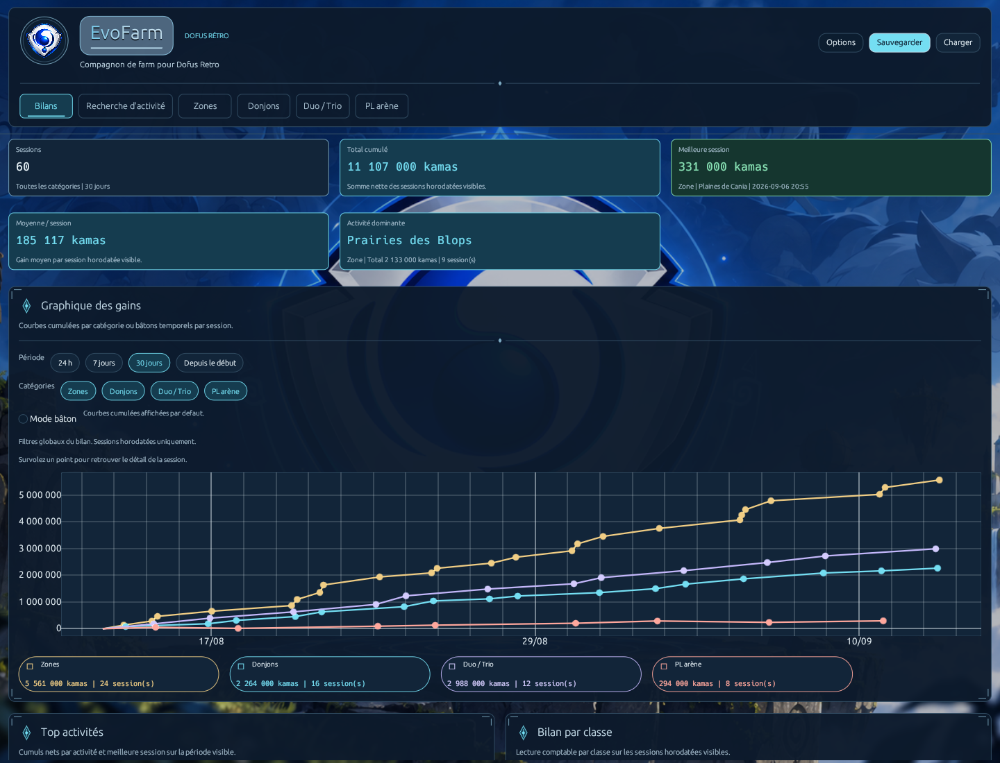

<table>
  <tr>
    <td width="50%" valign="top">
      <h4>02 · Zoom sur la semaine</h4>
      <a href="docs/demo/images/02-bilan-hebdomadaire.png">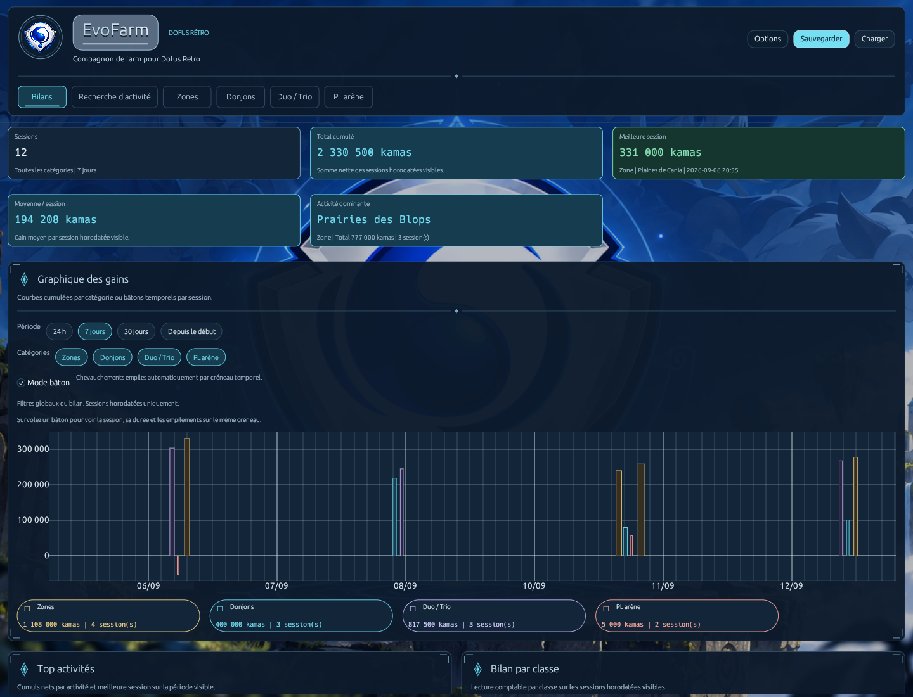</a>
      <p>Le filtre <strong>7 jours</strong> et le <strong>Mode bâton</strong> font ressortir les durées, les bonnes sorties et les pertes. Ici : 12 sessions, pour 2 330 500 kamas de valeur suivie.</p>
    </td>
    <td width="50%" valign="top">
      <h4>03 · Activités, classes et historique</h4>
      <a href="docs/demo/images/03-activites-classes-historique.png">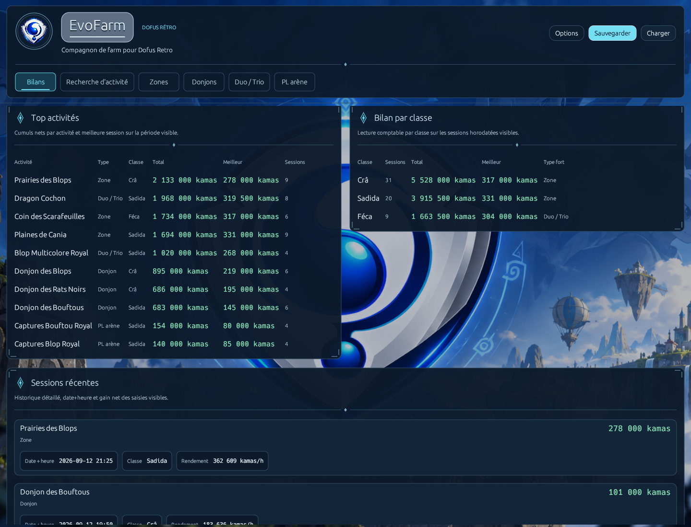</a>
      <p>Les classements et les sessions récentes relient les totaux aux sorties concrètes. Le joueur compare ses activités et retrouve les résultats de chaque classe.</p>
    </td>
  </tr>
</table>


### Choisir son prochain farm

**04 · « J'ai une heure avec mon Crâ. »** EvoFarm utilise les sessions passées pour proposer des activités compatibles, avec leur durée moyenne et leurs gains estimés.

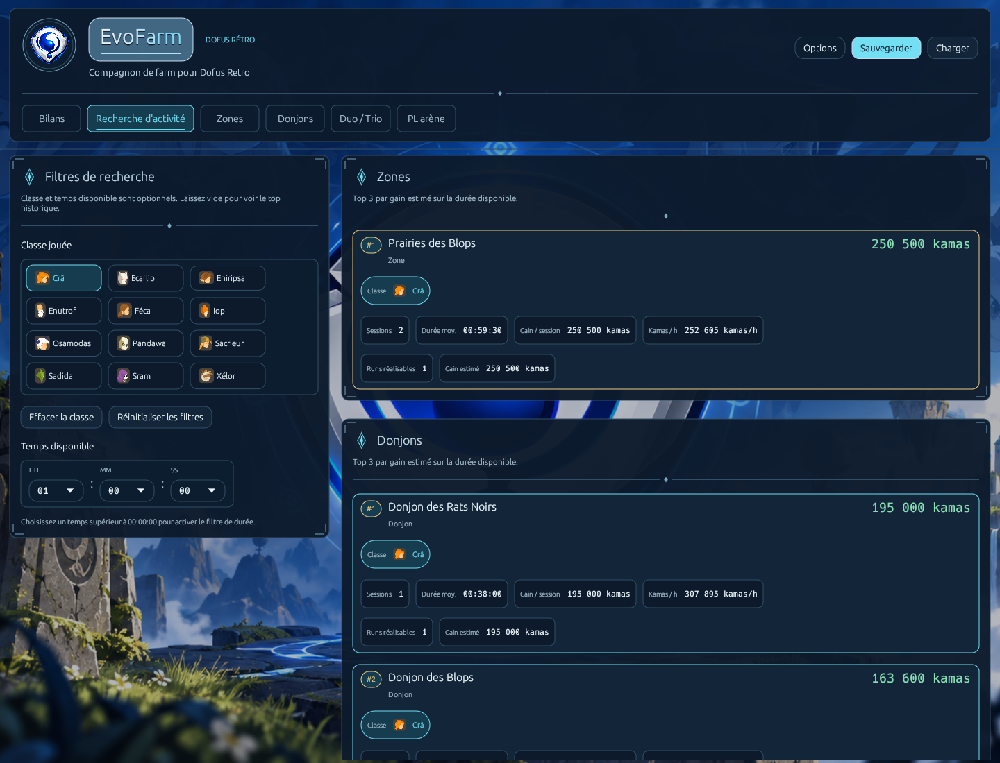

### Enregistrer ses résultats

Renseignez votre session : la prévision s'actualise avant validation, puis l'historique permet de comparer les sorties.

<table>
  <tr>
    <td width="50%" valign="top">
      <h4>05 · Farm en zone</h4>
      <a href="docs/demo/images/05-zones.png">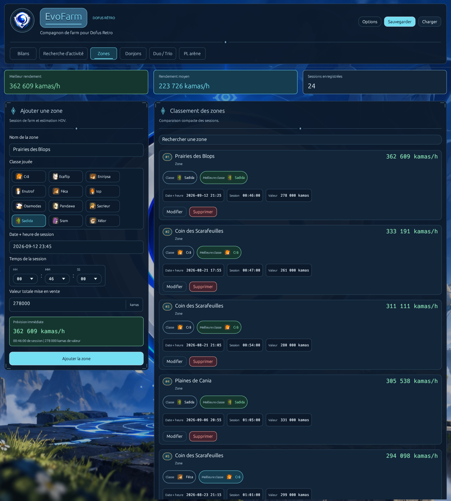</a>
      <p>La durée et la <strong>valeur estimée des ressources</strong> donnent le rendement en kamas par heure. Les 24 sessions de zones alimentent déjà le classement.</p>
    </td>
    <td width="50%" valign="top">
      <h4>06 · Runs de donjon</h4>
      <a href="docs/demo/images/06-donjons.png">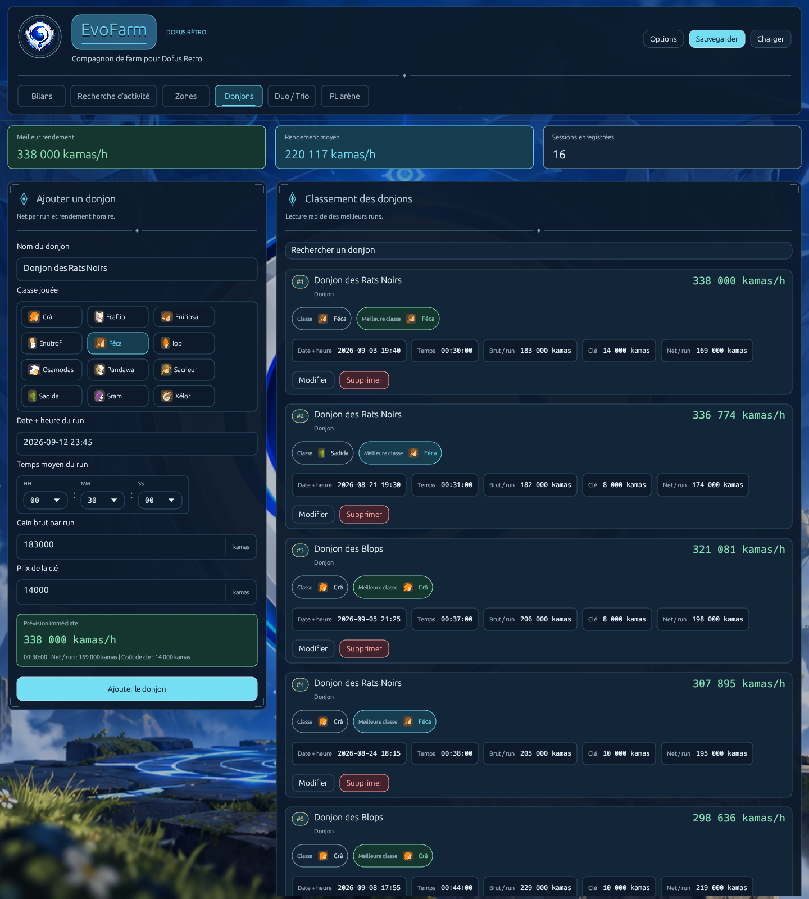</a>
      <p>Le coût de la clef est retiré du gain brut : <strong>183 000 − 14 000 = 169 000 kamas nets</strong>. Le joueur compare ensuite les runs enregistrés.</p>
    </td>
  </tr>
</table>


### Comparer les runs en équipe

Loot, clefs, pierre et revente de la capture : tous les montants renseignés contribuent au résultat du run. Le bénéfice concerne l'équipe entière, sans partage automatique entre joueurs.

<table>
  <tr>
    <td width="50%" valign="top">
      <h4>07 · Duo avec capture</h4>
      <a href="docs/demo/images/07-duo.png">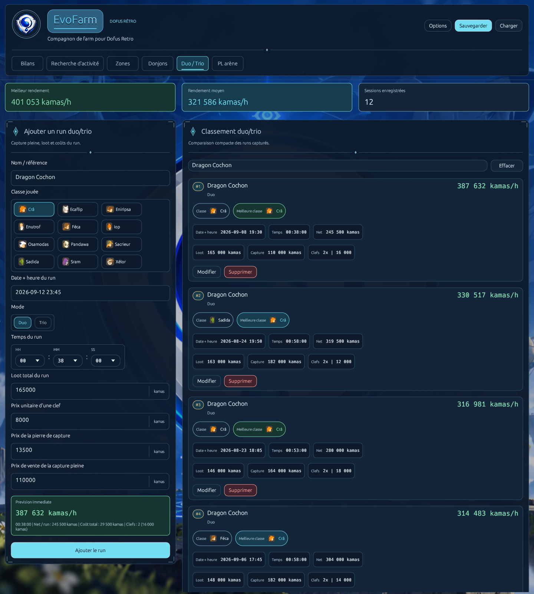</a>
      <p>Pour ce Dragon Cochon, EvoFarm prend en compte <strong>deux clefs</strong> et la pierre de capture. La prévision atteint <strong>245 500 kamas nets</strong>.</p>
    </td>
    <td width="50%" valign="top">
      <h4>08 · Passage au trio</h4>
      <a href="docs/demo/images/08-trio.png">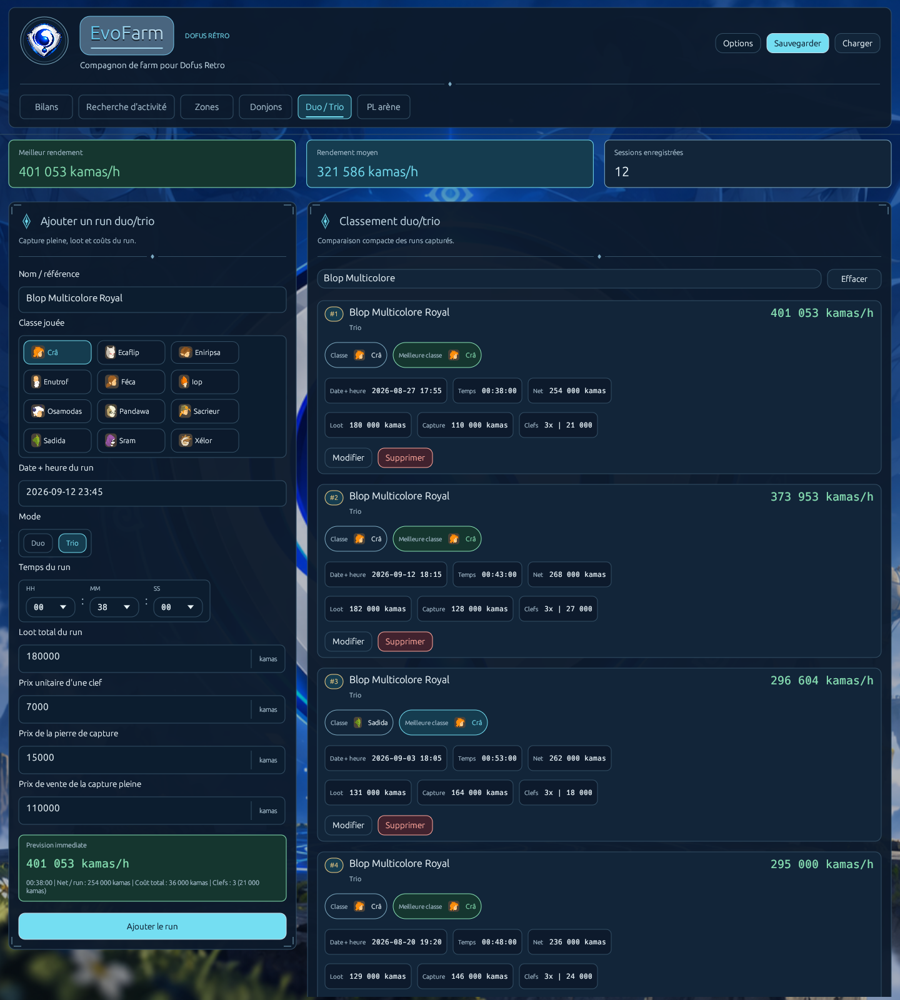</a>
      <p>Le mode Trio calcule le coût de <strong>trois clefs</strong>. Le Blop Multicolore Royal affiche <strong>254 000 kamas nets</strong>, avec les runs précédents dans la liste filtrée.</p>
    </td>
  </tr>
</table>


### Garder des résultats fidèles à ses sessions

Une sortie moins rentable ou une erreur de saisie font aussi partie du suivi quotidien.

<table>
  <tr>
    <td width="50%" valign="top">
      <h4>09 · Recettes et pertes en PL arène</h4>
      <a href="docs/demo/images/09-pl-arene.png">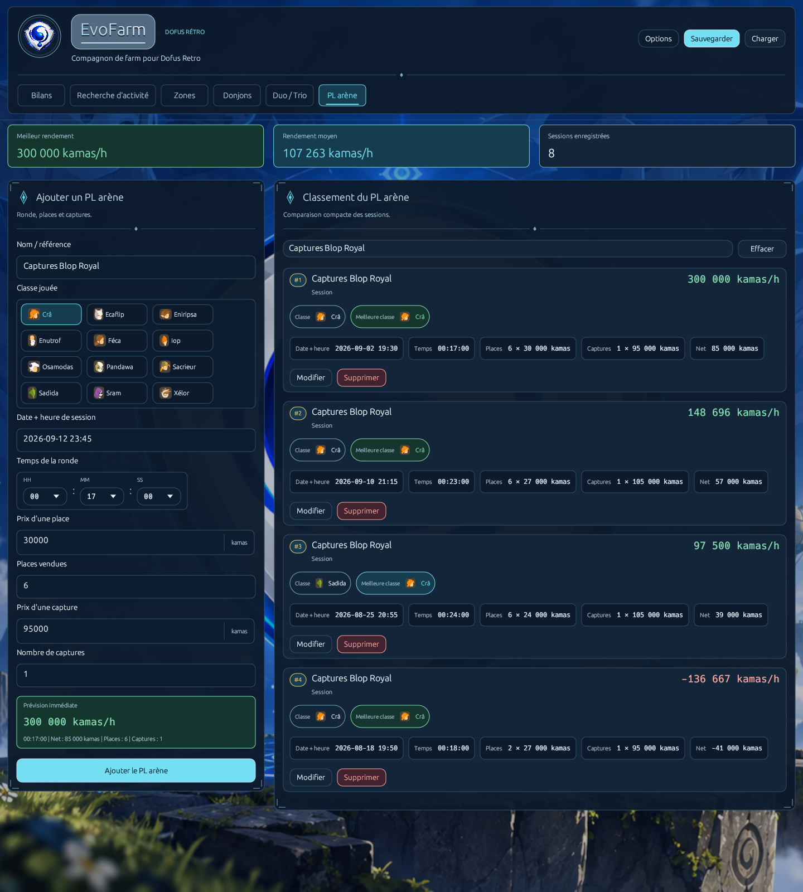</a>
      <p>EvoFarm retire le coût des captures des recettes des places vendues. Une session à <strong>−41 000 kamas</strong> reste visible et incluse dans les bilans.</p>
    </td>
    <td width="50%" valign="top">
      <h4>10 · Correction d'une session</h4>
      <a href="docs/demo/images/10-modifier-session.png">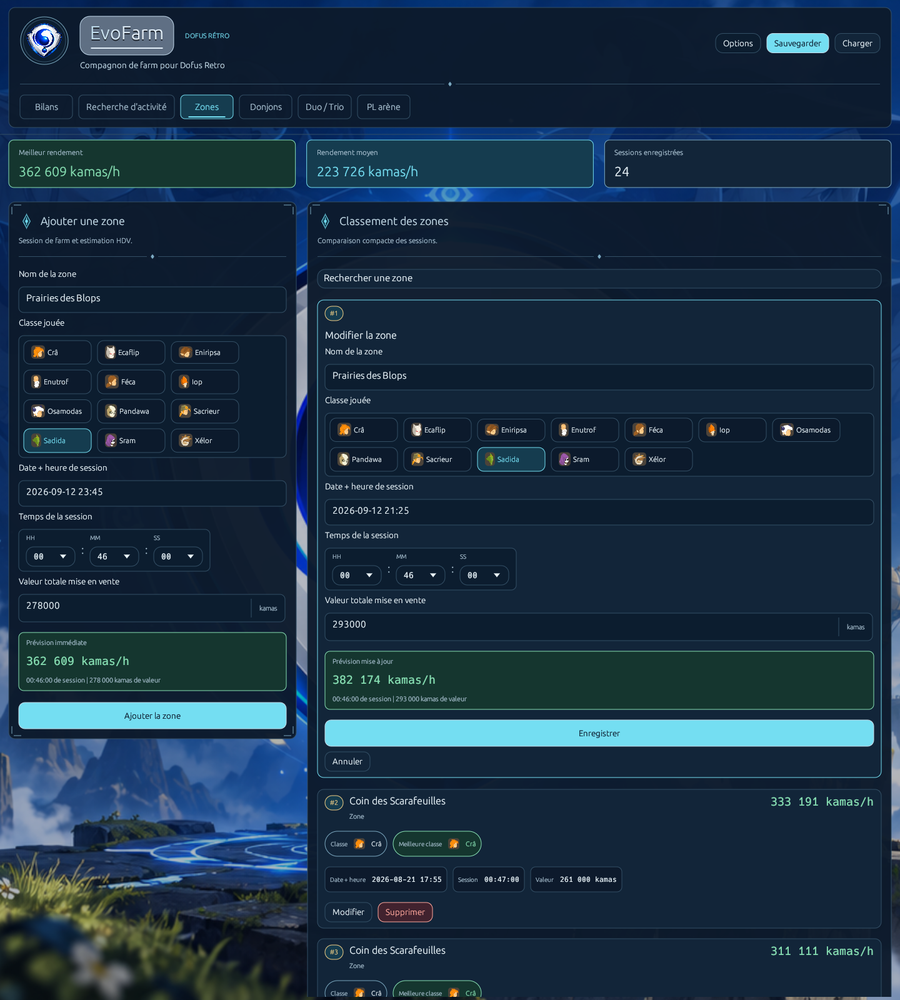</a>
      <p>Le bouton <strong>Modifier</strong> retrouve les champs existants. La prévision évolue immédiatement ; le joueur peut enregistrer ou annuler. Cette correction reste en cours dans la capture et ne change pas les totaux de la démo.</p>
    </td>
  </tr>
</table>


### Retrouver son historique

Conservez vos sessions et vos formulaires en préparation, puis retrouvez vos sauvegardes au fil du mois.

<table>
  <tr>
    <td width="50%" valign="top">
      <h4>11 · Sauvegarde nommée</h4>
      <a href="docs/demo/images/11-sauvegarder.png">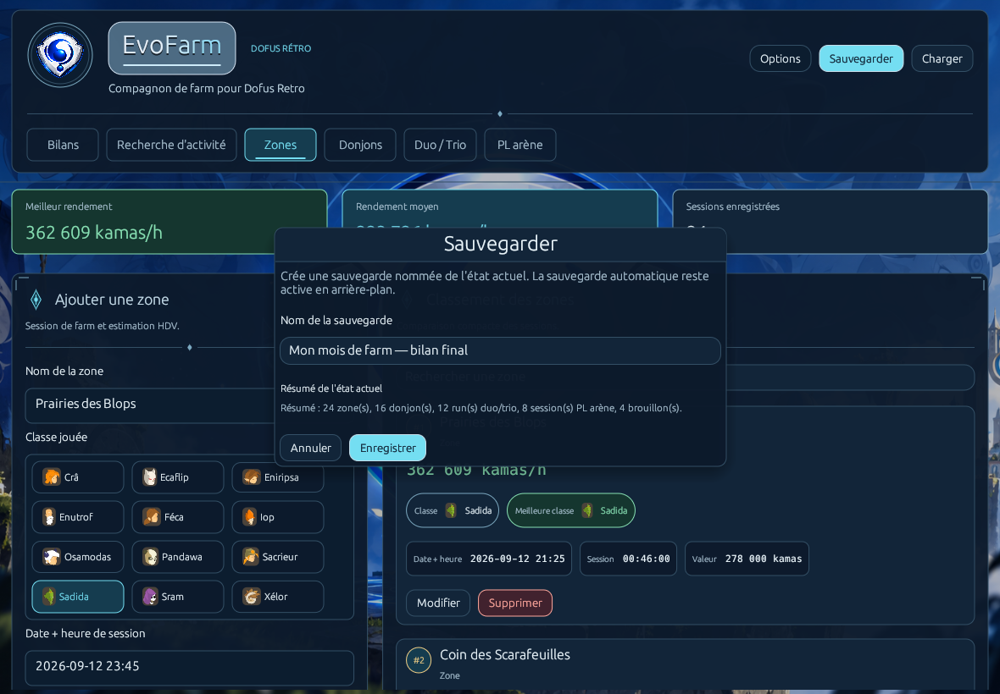</a>
      <p>Le dialogue résume les <strong>60 sessions et les quatre brouillons</strong> avant de conserver cet état du mois.</p>
    </td>
    <td width="50%" valign="top">
      <h4>12 · Bibliothèque du mois</h4>
      <a href="docs/demo/images/12-charger.png">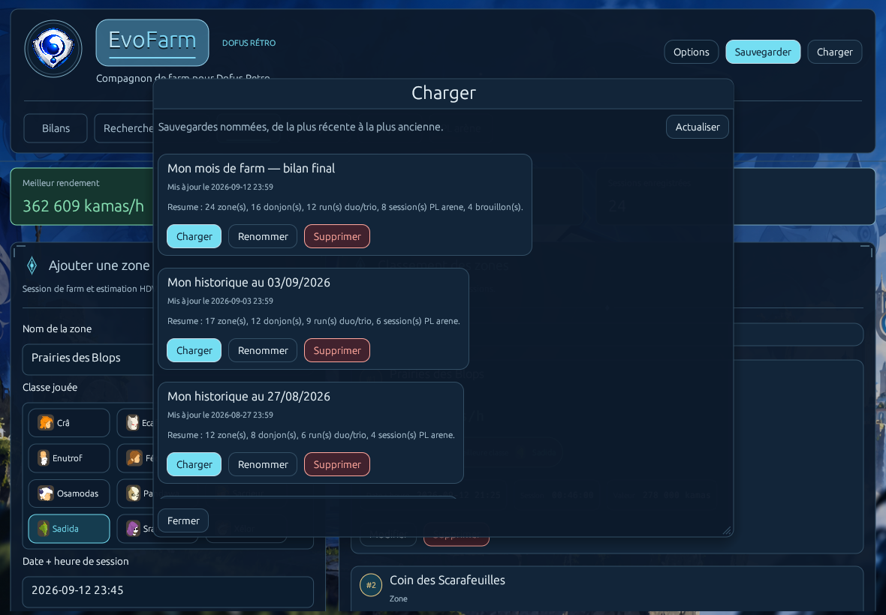</a>
      <p><strong>Charger, renommer, supprimer</strong> : chaque sauvegarde affiche sa date et son contenu. La démo illustre quatre instantanés hebdomadaires ; le JSON proposé contient l'état final.</p>
    </td>
  </tr>
</table>


<p align="center">
  <strong>Explorez ce même mois dans EvoFarm</strong><br>
  <a href="https://raw.githubusercontent.com/Donj63000/Dofus-Retro-EvoFarm-Dev-By-Donj63000-Coca/master/docs/demo/mois-demo.json">Télécharger le JSON fictif</a> ·
  <a href="docs/demo/README.md#importer-la-demo">Guide d'import</a> ·
  <a href="docs/demo/README.md">Les calculs en détail</a>
</p>

> Sauvegardez votre historique personnel avant l'import. Dans <strong>Bilans</strong>, choisissez <strong>Depuis le début</strong> pour retrouver les 60 sessions après la période de démonstration.

## Vos données restent sur votre ordinateur

EvoFarm fonctionne localement, sans service ni synchronisation cloud. Vos sessions et vos brouillons restent dans votre dossier utilisateur, séparément du programme.

<details>
<summary><strong>Emplacement des données, sauvegardes, import et mises à jour</strong></summary>

Le dossier de données dépend du système :

| Système | Dossier |
| --- | --- |
| Windows | `%LOCALAPPDATA%\EvoFarm\` |
| macOS | `~/Library/Application Support/EvoFarm/` |
| Linux | `$XDG_DATA_HOME/EvoFarm/`, ou `~/.local/share/EvoFarm/` si cette variable est absente |

Son contenu est le même sur les trois plateformes :

```text
data.json      Données et brouillons courants
data.json.bak  Copie de secours
saves/         Sauvegardes nommées
```

Fermez l'application puis remplacez le programme, le bundle ou le dossier portable pour mettre à jour EvoFarm. Les données sont conservées dans leur dossier séparé.

Les anciens emplacements sont reconnus automatiquement lorsqu'aucune sauvegarde EvoFarm n'existe. Les anciens fichiers restent conservés ; les nouveaux enregistrements utilisent le dossier EvoFarm. Si un fichier principal est invalide, sa copie de secours est essayée. Une erreur est signalée si les deux fichiers prioritaires sont illisibles.

**Importer un JSON remplace les données actuellement chargées.** Créez une sauvegarde nommée si vous souhaitez conserver plusieurs historiques. Pour transférer vos données entre ordinateurs ou systèmes, copiez manuellement `data.json` depuis le dossier de données puis importez cette copie sur l'autre ordinateur. Aucune synchronisation automatique entre appareils n'est fournie.

</details>

## Documentation technique

<details>
<summary><strong>Compiler, tester et créer les distributions Windows, Linux et macOS</strong></summary>

La CI utilise Rust **1.93.0**. Installez **Python 3.11 ou ultérieur** pour les scripts de packaging Unix et leurs tests. Les commandes suivantes vérifient le code sur le système courant :

```text
cargo run --locked
cargo fmt --all -- --check
cargo test --locked --all-targets
cargo clippy --locked --all-targets -- -D warnings
cargo install cargo-audit --version 0.22.1 --locked
cargo audit
```

Tests Python : `python3 -m unittest discover -s scripts -p 'test_*.py'`. Sous Windows, utilisez `py -3.13` ou votre interpréteur Python 3.11+ à la place de `python3`.

### Distribution Windows

Prérequis : cible Rust `x86_64-pc-windows-msvc`, outils C++ de Visual Studio et SDK Windows.

```powershell
rustup target add x86_64-pc-windows-msvc
powershell -NoProfile -ExecutionPolicy Bypass -File .\scripts\test-packaging.ps1
powershell -NoProfile -ExecutionPolicy Bypass -File .\scripts\build-release.ps1
```

Les 21 scénarios PowerShell vérifient le packaging Windows. Le script de construction compile en release avec `Cargo.lock`, puis produit à la racine **EvoFarm.exe**, **EvoFarm-Windows-x64.zip** et **SHA256SUMS**. Ce manifeste local couvre seulement les deux produits Windows. Le ZIP contient le programme et son mode d'emploi.

La signature locale est facultative : les trois variables `SIGNTOOL_EXE`, `SIGN_CERT_PATH` et `SIGN_CERT_PASSWORD` doivent être configurées ensemble. Une erreur de compilation, de signature ou d'archivage interrompt le script.

### Distribution Linux

La construction s'effectue sur Linux x64. Pour une base comparable à la release, utilisez Ubuntu 22.04 avec les outils de compilation et bibliothèques graphiques :

```bash
sudo apt install build-essential pkg-config libx11-dev libx11-xcb-dev \
  libxcb-render0-dev libxcb-shape0-dev libxcb-xfixes0-dev libxkbcommon-dev \
  libxkbcommon-x11-0 libgl1-mesa-dev libegl1-mesa-dev libwayland-dev
rustup target add x86_64-unknown-linux-gnu
python3 scripts/build-unix-release.py --platform linux
```

Le script produit **dist/EvoFarm-Linux-x64.tar.gz** et **dist/SHA256SUMS-linux**.

### Distribution macOS universelle

La construction s'effectue sur un Mac avec les outils en ligne de commande de Xcode (`xcode-select --install`), Python 3.11+ et les deux cibles Rust :

```bash
rustup target add x86_64-apple-darwin aarch64-apple-darwin
python3 scripts/build-unix-release.py --platform macos
```

Le script compile les deux architectures, les réunit avec `lipo`, génère l'icône ICNS à partir de `logo.png`, puis signe et vérifie le bundle. Il produit **dist/EvoFarm-macOS-universal.zip** et **dist/SHA256SUMS-macos**. `MACOSX_DEPLOYMENT_TARGET` vaut `11.0` par défaut ; le relever limite les systèmes pouvant lancer votre compilation locale.

Les scripts de construction respectent `CARGO_TARGET_DIR`, relatif au projet ou absolu. Le script Unix accepte également `--output-dir`. Les archives contiennent uniquement les fichiers nécessaires à la distribution ; les sources, données personnelles, caches et captures de contrôle en sont exclus.

### Contrôle visuel Windows

Sur un bureau Windows disponible, un test complémentaire génère des captures des écrans à plusieurs tailles et facteurs DPI, avec des données fictives :

```powershell
cargo test --locked --release --bin evofarm native_visual_review -- --ignored --test-threads=1 --nocapture
```

Les captures et leur manifeste sont enregistrés dans `target/qa/visual`. Ce contrôle ne charge ni ne modifie les sauvegardes personnelles.

## Publication

La [CI multiplateforme](https://github.com/Donj63000/Dofus-Retro-EvoFarm-Dev-By-Donj63000-Coca/actions/workflows/ci.yml) utilise **Windows 2022 x64, Ubuntu 22.04 x64, macOS 15 ARM64 et macOS 15 Intel**. Elle vérifie le format, Clippy, les tests Rust, les scripts de packaging et les dépendances. Des contrôles de démarrage complètent la validation des programmes Linux et macOS. Chaque architecture macOS exécute ses tests nativement.

Un tag `vX.Y.Z` correspondant à la version de `Cargo.toml` lance cette validation avant publication. La GitHub Release réunit **EvoFarm.exe**, **EvoFarm-Windows-x64.zip**, **EvoFarm-Linux-x64.tar.gz**, **EvoFarm-macOS-universal.zip** et un **SHA256SUMS global de quatre lignes**. Les sources restent disponibles dans le dépôt et les archives source de GitHub ; les binaires ne sont pas stockés dans l'historique courant des sources.

</details>

## Crédits

**Dofus Retro EvoFarm [Dev By Donj63000(Coca)]**

Remerciements spéciaux à **Clody**, pour une partie du travail réalisé sur ce logiciel, des idées qui l'ont fait avancer et de la manière dont le projet a été pensé.

EvoFarm n'est pas l'œuvre d'un seul auteur : cette contribution fait pleinement partie de son histoire et de sa conception.

<p align="center"><a href="#haut">Retour en haut</a> · <a href="https://github.com/Donj63000/Dofus-Retro-EvoFarm-Dev-By-Donj63000-Coca/releases/latest">Télécharger EvoFarm</a></p>
