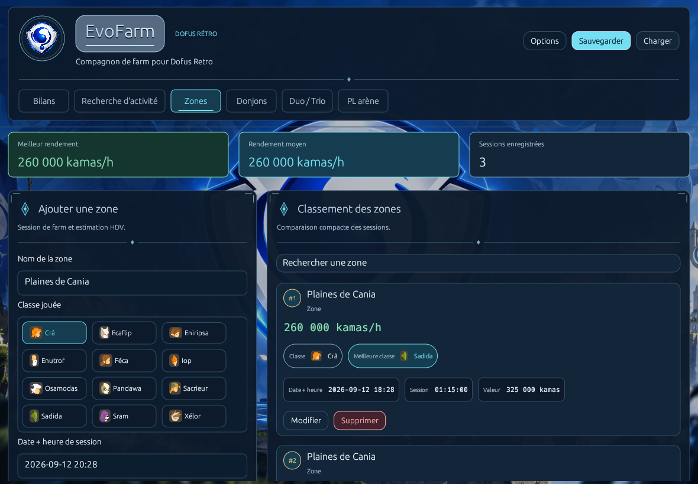

<p align="center">
  
</p>

<h1 align="center">Dofus Retro EvoFarm</h1>
<p align="center"><strong>Dev By Donj63000(Coca)</strong><br>Votre compagnon de farm pour Dofus Retro.</p>

<p align="center">
  <a href="https://github.com/Donj63000/Dofus-Retro-EvoFarm-Dev-By-Donj63000-Coca/releases/latest/download/EvoFarm.exe"><strong>Télécharger pour Windows x64</strong></a>
  ·
  <a href="https://github.com/Donj63000/Dofus-Retro-EvoFarm-Dev-By-Donj63000-Coca/releases/latest/download/EvoFarm-Windows-x64.zip">Archive portable ZIP</a>
  ·
  <a href="https://github.com/Donj63000/Dofus-Retro-EvoFarm-Dev-By-Donj63000-Coca/releases">Toutes les versions</a>
</p>

EvoFarm transforme vos résultats de jeu en bilans clairs : enregistrez vos sessions, calculez vos bénéfices nets et comparez les activités selon votre classe et votre temps disponible. L'application s'adresse à **tous les joueurs de Dofus Retro**.

Son interface bleu nuit, cyan et argent réunit les portraits des douze classes, des formulaires lisibles et des graphiques. Le logo, le fond et les icônes sont intégrés au programme.



*Aperçu de l’application avec des données de démonstration.*

## Commencer en quelques instants

1. Téléchargez **EvoFarm.exe** ci-dessus, ou extrayez l'archive ZIP.
2. Placez le programme dans le dossier de votre choix et lancez-le.
3. Sélectionnez une activité, renseignez votre session et consultez vos bilans.

**Windows 64 bits.** Aucun installateur, compte ou abonnement n'est requis. L'application fonctionne localement ; elle n'installe aucun service et ne synchronise pas vos données sur Internet. Un raccourci vers `EvoFarm.exe` permet de l'épingler au menu Démarrer ou à la barre des tâches.

Chaque release fournit un fichier [SHA256SUMS](https://github.com/Donj63000/Dofus-Retro-EvoFarm-Dev-By-Donj63000-Coca/releases/latest/download/SHA256SUMS). Pour comparer l'empreinte du téléchargement :

```powershell
Get-FileHash .\EvoFarm.exe -Algorithm SHA256
```

Les distributions GitHub ne disposent pas d'une signature Authenticode.

## Suivre et comparer vos activités

| Activité | Ce que vous mesurez |
| --- | --- |
| **Zones** | Durée totale, valeur de la session et kamas par heure. |
| **Donjons** | Gains bruts, coût de la clef et bénéfice net par run. |
| **Duo / Trio** | Loot, clefs, pierre de capture et valeur de revente de la capture pleine. |
| **PL arène** | Places vendues, recettes, coût des captures et bénéfice net. |

- Classe, date et heure associées à chaque session.
- Modification, suppression et recherche des entrées.
- Bilans sur 24 h, 7 jours, 30 jours ou l'historique complet.
- Indicateurs, classements, graphiques en barres et courbes.
- Recherche d'activités selon la classe et le temps disponible.
- Sauvegardes nommées : créer, charger, renommer et supprimer vos jeux de données.
- Import JSON, copie de secours et conservation des brouillons.

## Vos données restent sur votre ordinateur

Sous Windows, les fichiers sont conservés dans :

```text
%LOCALAPPDATA%\EvoFarm\data.json      Données et brouillons courants
%LOCALAPPDATA%\EvoFarm\data.json.bak  Copie de secours
%LOCALAPPDATA%\EvoFarm\saves\        Sauvegardes nommées
```

Remplacer l'exécutable pour installer une nouvelle version conserve ces fichiers.

Les anciens emplacements sont reconnus automatiquement lorsqu'aucune sauvegarde EvoFarm n'existe. Les anciens fichiers restent conservés ; les nouveaux enregistrements utilisent le dossier EvoFarm. Si un fichier principal est invalide, sa copie de secours est essayée. Une erreur est signalée si les deux fichiers prioritaires sont illisibles.

**Importer un JSON remplace les données actuellement chargées.** Créez une sauvegarde nommée si vous souhaitez conserver plusieurs historiques.

## Compiler et vérifier le projet

Prérequis : Rust avec la cible `x86_64-pc-windows-msvc`, les outils C++ de Visual Studio et le SDK Windows. La CI utilise Rust **1.93.0**.

```powershell
cargo run --locked
cargo fmt --all -- --check
cargo test --locked --all-targets
cargo clippy --locked --all-targets -- -D warnings
powershell -NoProfile -ExecutionPolicy Bypass -File .\scripts\test-packaging.ps1
cargo install cargo-audit --version 0.22.1 --locked
cargo audit
```

Construire la distribution Windows :

```powershell
powershell -NoProfile -ExecutionPolicy Bypass -File .\scripts\build-release.ps1
```

Le script compile en release avec `Cargo.lock`, puis produit à la racine **EvoFarm.exe**, **EvoFarm-Windows-x64.zip** et **SHA256SUMS**. Le ZIP contient le programme et son mode d'emploi ; les sources sont disponibles dans ce dépôt et dans les archives source des releases. Les fichiers personnels, caches et captures de contrôle en sont exclus.

La signature locale est facultative : les trois variables `SIGNTOOL_EXE`, `SIGN_CERT_PATH` et `SIGN_CERT_PASSWORD` doivent être configurées ensemble. Une erreur de compilation, de signature ou d'archivage interrompt le script.

Sur un bureau Windows disponible, un test complémentaire génère des captures des écrans à plusieurs tailles et facteurs DPI, avec des données fictives :

```powershell
cargo test --locked --release --bin evofarm native_visual_review -- --ignored --test-threads=1 --nocapture
```

Les captures et leur manifeste sont enregistrés dans `target/qa/visual`. Ce contrôle ne charge ni ne modifie les sauvegardes personnelles.

## Publication

La [CI Windows](https://github.com/Donj63000/Dofus-Retro-EvoFarm-Dev-By-Donj63000-Coca/actions/workflows/ci.yml) vérifie le format, Clippy, les tests, le packaging et les dépendances avant de construire les artefacts.

Un tag `vX.Y.Z` correspondant à la version de `Cargo.toml` lance la même validation, puis publie les trois fichiers dans une GitHub Release. Les binaires sont distribués par les releases et ne sont pas stockés dans l'historique courant des sources.

## Crédits

**Dofus Retro EvoFarm [Dev By Donj63000(Coca)]**

Remerciements spéciaux à **Clody**, pour une partie du travail réalisé sur ce logiciel, des idées qui l'ont fait avancer et de la manière dont le projet a été pensé.

EvoFarm n'est pas l'œuvre d'un seul auteur : cette contribution fait pleinement partie de son histoire et de sa conception.
